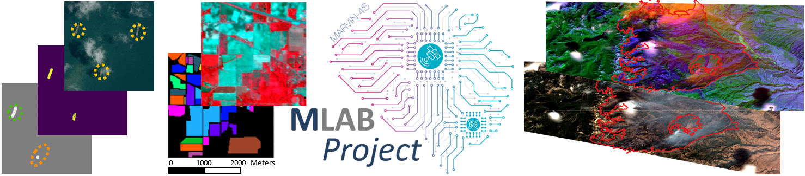

# Machine Learning Application Benchmark

<Description of benchmark>
The Machine Learning Application Benchmark (MLAB) has the aim of combining aspects relevant to machine learning (ML) and hardware in order to create a unique ML benchmark for the space domain. It consists of multiple applications spanning anomaly detection, radio modulation classification, object detection for optical and multispectral images in order to detect ships, airplanes and wildfires, and land use / land cover classification. For every application, submissions can be made to one of four categories:

- Open Hardware & Model
- Open Hardware & Closed Model
- Closed Hardware & Open Model
- Closed Hardware & Model

Thereby, "open" and "closed" refer to the option of using different hardware platforms or ML models. Note that the submission category "Closed Hardware & Model" aims to compare different pre- and postprocessing techniques and hardware components.

## Leaderboard

Use Case A: Anomaly Detection

| Open HW & Model       |  F0.5-score  | Throughput (Frames / s)   | Energy (µJ / Bit)   | Peak Power (W) | Idle Power (W) |
| :-------------------- | :----------: | :-----------------------: | :-----------------: | :------------: | :------------: |
|       reference       |     67.4     |         1634.25           |       0.147         |        5.1     |       4.9      |
|                       |              |                           |                     |                |                |

<Dataset description>

<Submission format>

<Submission process>
